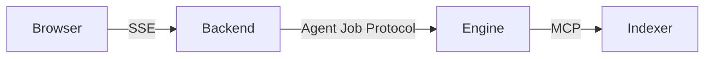

# Skill: diagrams

**Roles**: ask

Use diagrams to explain structure and flow. The chat UI renders **Mermaid** code
blocks as diagrams, so a `mermaid` fenced block becomes a picture, not text.

## When to draw

Reach for a diagram when words would be slower than a picture:

- **Architecture / components** — how services, modules, or packages relate.
- **Request / data flow** — the path a call takes end to end (`flowchart`).
- **Sequence** — ordered interactions between parts over time (`sequenceDiagram`).
- **State machines** — lifecycle or status transitions (`stateDiagram-v2`).
- **Data model / relationships** — entities and their links (`erDiagram`, `classDiagram`).

Prefer a diagram *plus* a sentence of context over a long prose description.

## How to draw

- Emit a fenced ```mermaid block. Keep it valid Mermaid — the UI renders it live,
  so a syntax error shows as a broken block.
- Keep node labels short; put detail in the surrounding text.
- Trace real code: name the actual files, functions, or services (use
  `semantic_search` / `read_range` first) rather than inventing a generic picture.
- Pick the simplest diagram type that answers the question; don't over-draw.
- For anything non-trivial, briefly say what the diagram shows before or after it.

## Example

````

````

Only draw when it genuinely helps — a two-line answer doesn't need a diagram.
